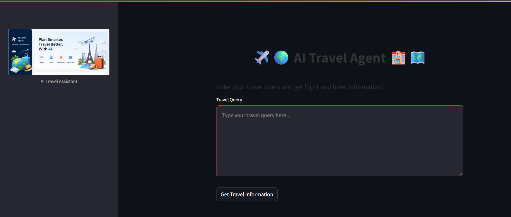
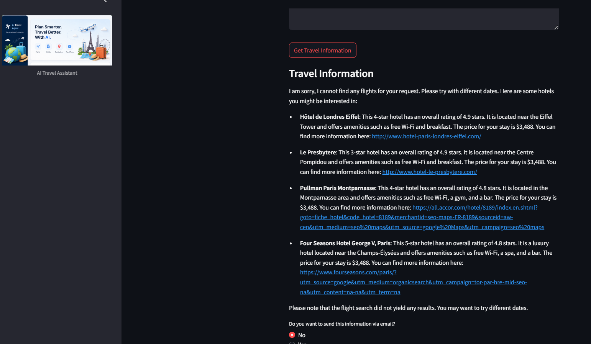
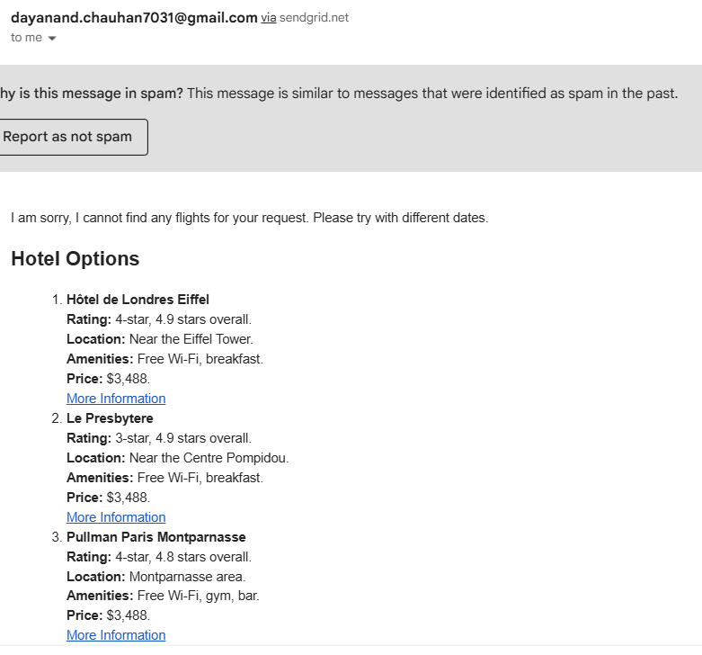
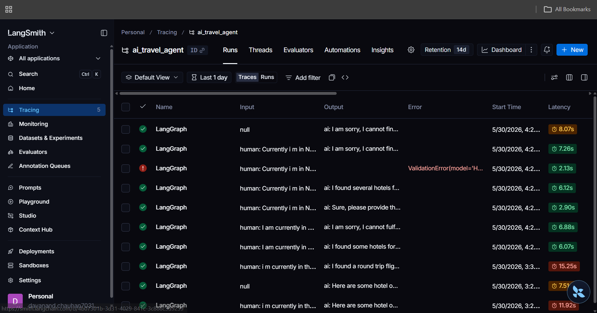

# ✈️ AI-Based Travel Planner Agent

An intelligent AI-powered travel planning assistant built using LangGraph, Streamlit, OpenRouter/OpenAI, SerpAPI, and SendGrid.

This project demonstrates how to build production-style AI agents capable of:

* flight and hotel discovery
* tool calling
* human-in-the-loop workflows
* observability and tracing
* automated email generation

---

# 🚀 Features

* Stateful AI agent interactions
* Multi-tool orchestration using LangGraph
* Flight search using Google Flights (SerpAPI)
* Hotel recommendations using Google Hotels (SerpAPI)
* Human-in-the-loop approval flow
* AI-generated HTML travel emails
* LangSmith observability support
* OpenRouter free-model support
* Streamlit frontend UI

---

# 🛠 Improvements Added

* Integrated OpenRouter support
* Added robust API error handling
* Improved flight and hotel tool resilience
* Added LangSmith observability
* Added SendGrid email integration
* Improved Streamlit deployment compatibility

---

# 🧠 Supported LLM Providers

This project supports:

* OpenAI
* OpenRouter (recommended free option)

Example `.env` configuration:

```env
OPENAI_API_KEY=your_openrouter_or_openai_key
OPENAI_BASE_URL=https://openrouter.ai/api/v1
```

### Recommended Free Models

* `openrouter/auto`
* `meta-llama/llama-3.3-8b-instruct:free`
* `google/gemma-3-27b-it:free`

---

# 📦 Installation

Clone the repository:

```bash
git clone https://github.com/Dayanand7031/AI-Based-Travel-Planner-Agent.git
cd AI-Based-Travel-Planner-Agent
```

Install dependencies:

```bash
poetry install --no-root
```

Activate virtual environment:

```bash
poetry shell
```

---

# 🔑 Environment Variables

Create a `.env` file in the project root:

```env
OPENAI_API_KEY=your_openrouter_or_openai_key
OPENAI_BASE_URL=https://openrouter.ai/api/v1

SERPAPI_API_KEY=your_serpapi_key

SENDGRID_API_KEY=your_sendgrid_key
FROM_EMAIL=your_email@gmail.com
TO_EMAIL=your_email@gmail.com
EMAIL_SUBJECT=AI Travel Plan

LANGCHAIN_API_KEY=your_langsmith_key
LANGCHAIN_TRACING_V2=true
LANGCHAIN_PROJECT=ai_travel_agent
```

---

# ▶️ Run Locally

```bash
poetry run streamlit run app.py
```

---

# 🌍 Example Prompt

```text
I am currently in New Delhi and I want a one-month travel plan for Paris in June 2026.
```

---

# 📊 Architecture

* Streamlit Frontend
* LangGraph Agent Orchestration
* Tool Calling System
* OpenRouter/OpenAI Integration
* SerpAPI Integration
* SendGrid Email Automation
* LangSmith Observability

---

# 🖼 Screenshots

## Home Page



## Travel Results



## Email Output



## LangSmith Tracing



---

# ☁️ Deployment

## Streamlit Cloud

1. Push project to GitHub
2. Create `requirements.txt`
3. Deploy using Streamlit Cloud
4. Add secrets in Streamlit dashboard

Run locally:

```bash
poetry run streamlit run app.py
```

---

# 📈 Observability with LangSmith

This project supports:

* LLM tracing
* tool monitoring
* graph execution visualization
* debugging AI workflows

---

# 📧 Email Integration

SendGrid is used to generate and deliver AI-generated HTML travel plans directly to the user’s inbox.

---

# ⚠️ Notes

* Flight and hotel data are fetched using Google Flights and Google Hotels APIs via SerpAPI.
* This project is intended for educational and portfolio purposes.

---

# 👨‍💻 Maintainer

Maintained and customized by Dayanand Chauhan.

---
